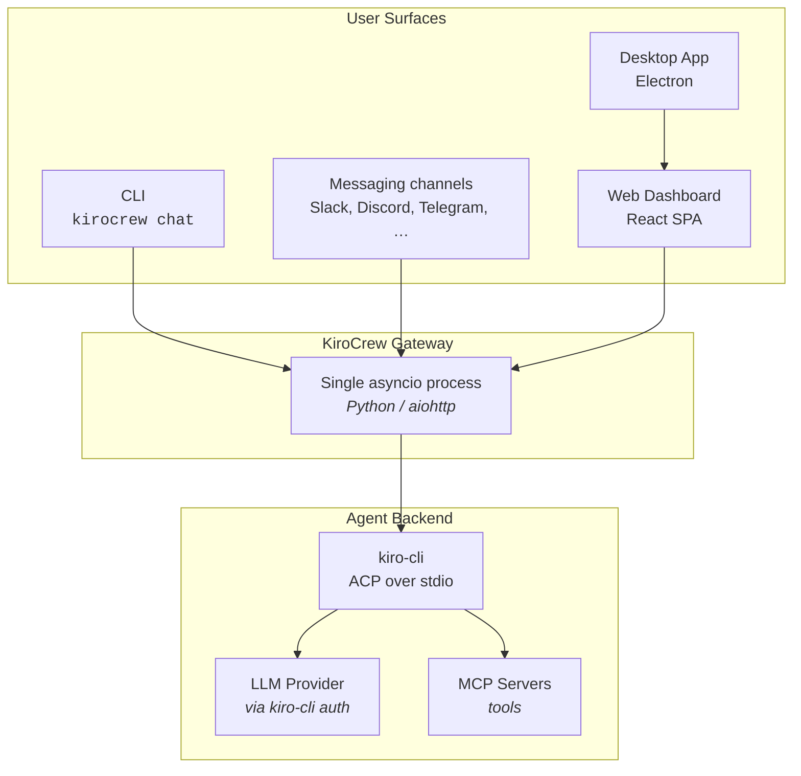
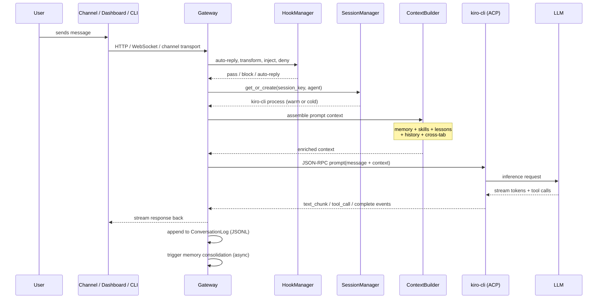
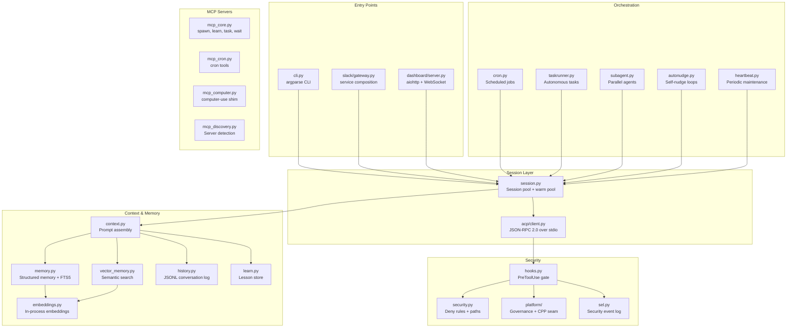
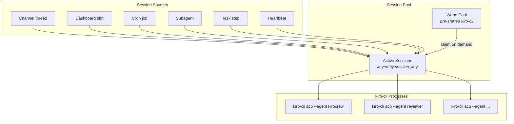
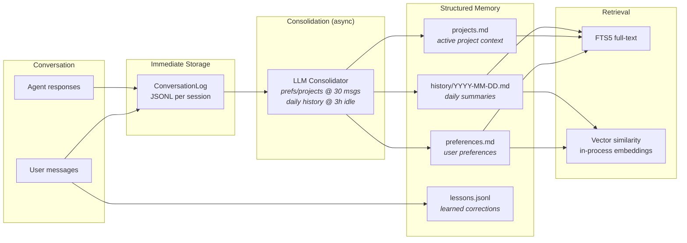
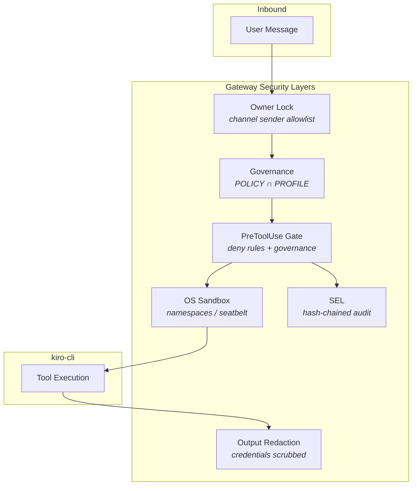
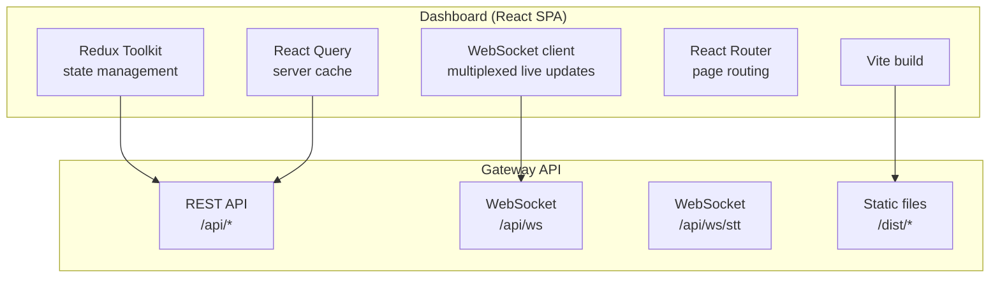
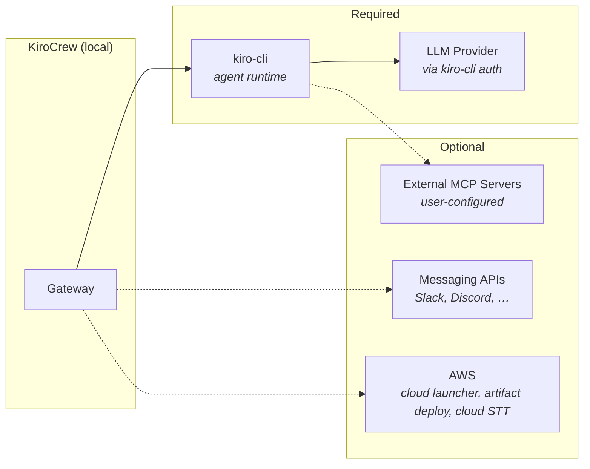
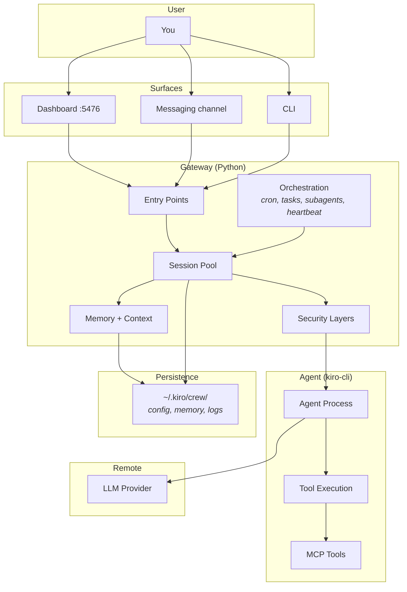

# Architecture Overview

The entry point for Kiro Crew's architecture: what the gateway is, how the pieces
connect, and where to read further. This is a **map**, not a manual. Every
subsystem has a module spec under
[`../system-specs/modules/`](../system-specs/README.md); the
[Feature and subsystem map](#feature-and-subsystem-map) below indexes all of
them with their owning source path.

For installation see [`../guides/install.md`](../guides/install.md); for a first
run see [`../guides/install.md`](../guides/install.md).

---

## What Kiro Crew is, and what it adds

Three layers sit beneath Kiro Crew, and the distinction matters:

1. **kiro-cli** is an agent *runtime*, not an agent. It owns the LLM connection,
   tool execution (bash, file read/write, grep, glob), MCP server management,
   session persistence, context compaction, and **ACP** (the Agent Client
   Protocol): a JSON-RPC 2.0 stdio interface any orchestrator can drive.
2. **Agent configs** (JSON under `~/.kiro/agents/`) tell kiro-cli *how* to
   behave: system prompt, enabled tools, MCP servers. Every agent runs as
   `kiro-cli acp --agent <name>`; the `--agent` flag selects the config, the
   runtime is always kiro-cli. Kiro Crew generates and refreshes its own
   `kirocrew.json` there (`agent.py`).
3. **Kiro Crew** is the gateway: a single asyncio process that multiplexes
   surfaces onto that runtime and adds everything a runtime deliberately has no
   opinion about.

Kiro Crew is **KiroACP-only**: `agent.provider` is fixed to `acp`, and kiro-cli is
a hard requirement.

| Capability | kiro-cli alone | With Kiro Crew |
|---|---|---|
| Sessions | One per terminal | Many concurrent (channel threads, dashboard slots, cron jobs, subagents, task steps) |
| Surfaces | Terminal only | CLI, web dashboard, Electron desktop, and seven messaging channels |
| Persistence | Per-directory transcript | Cross-session memory (preferences, projects, daily history, lessons) |
| Cross-session awareness | None | Sessions share memory, so one session sees what another learned |
| Scheduling | None | Cron jobs (`every` / `at` / `cron` expression) with cross-process file locking |
| Autonomous tasks | None | TaskRunner: spec, decompose, execute, retry, replan, checkpoint |
| Self-learning | None | Lessons extracted from corrections, injected into later sessions |
| Tool gating | Per-agent config | An independent PreToolUse gate plus a two-level governance ceiling the agent cannot weaken |
| Context management | Manual compaction | Auto-compaction at a configurable threshold, budget-aware context assembly, decaying memory |
| Process resilience | Manual restart | Warm pool, circuit breaker, crash recovery, idle cleanup, orphan PID tracking |

### Why orchestrate agents at all

- **Unattended work.** Cron jobs, TaskRunner specs, and subagents run with no
  human typing commands.
- **Specialization.** Different surfaces and jobs can each run a different agent
  config concurrently.
- **Accumulation.** Conversations feed shared memory and lessons persist, so a
  later session starts with what an earlier one learned.

### The agent hierarchy

`kirocrew` is itself just an agent config, at the same level as any other. What
makes it the coordinator is that the gateway defaults to it and it holds the MCP
tools (`spawn_run`, `cron_add`, `task_run`) that ask the gateway to open sessions
with other agents. The gateway code is agent-agnostic; coordination behavior
lives in the agent config.

```
KiroCrew Gateway
  ├── CLI chat / channel DM        → agent.default_agent (falls back to kirocrew)
  ├── Dashboard slot               → the slot's chosen agent (falls back to kirocrew)
  ├── Cron job                     → per-job agent_id, or agent_sequence
  ├── Subagent (spawn_run)         → the spawn's `agent`, else the parent session's
  └── TaskRunner (task_run)        → the agent named when the plan starts
```

## High-level shape



## Message flow

A user message is hooked, routed to a session, enriched with context, forwarded
to kiro-cli over ACP, and streamed back.



Tool calls do **not** simply pass through: every one is evaluated at Kiro Crew's
own PreToolUse gate before kiro-cli is allowed to run it. See
[Security layers](#security-layers).

## Repository layout

| Path | Purpose |
|---|---|
| `src/kiro_crew/` | Python backend: gateway, sessions, memory, cron, MCP servers, built-in apps |
| `src/kiro_crew/config/defaults.json`, `prompt.md` | Bundled base agent config and system prompt |
| `src/kiro_crew/builtin_skills/` | Skills bundled into the package, copied to the data home on start |
| `src/kiro_crew/static/dist/` | Staged frontend bundle served by the backend |
| `website/` | React + TypeScript + Tailwind dashboard (Vite) |
| `website/electron/` | Electron desktop shell |
| `skills/` | Checkout-only reference skills, loaded via `KIROCREW_PROJECT_DIR`; not packaged |
| `packages/` | Standalone SDK packages (`kirocrew-client-py`) |
| `packaging/`, `docker/` | Desktop bundle + container build inputs |
| `scripts/` | Build tooling, linters, dev helpers |
| `docs/` | Contributor and architecture docs (this tree) |
| `test/` | pytest suite |

A skill that a shipped feature depends on must live in
`src/kiro_crew/builtin_skills/`; only `src/` is packaged, so a required skill
placed in top-level `skills/` never reaches an installed user.

## Backend component map



## Session management

Each session is an independent ACP connection with its own context and
transcript, keyed by a `session_key` that encodes its origin.



- **Warm pool** (`session.pool_size`, default `0` = off) pre-spawns processes so
  a new session starts without paying kiro-cli's cold start. Pooled processes
  older than `session.pool_ttl_secs` (default 1800s) are discarded at claim time.
- **Idle timeout** reclaims a session after `session.timeout_secs`, default
  **3600s**.
- **Turn ceiling**: `agent.chat_turn_timeout_secs` defaults to **7200s** (2h),
  clamped to 300s..7200s and never disable-able. It is a runaway backstop, so a
  turn that hits it ends with a card naming the limit rather than failing
  silently. The ACP transport carries its own prompt timeout of the same
  magnitude and bounds the turn first.
- **Circuit breaker**: five consecutive failures on one session force a reset.
- **Auto-compaction** at `session.autocompact_pct` of the context window
  (default 90%).

### Lifecycle by caller

The pattern differs by who owns the conversation, and the difference is the point:
a surface a human is watching keeps its session, a background job must not.

| Caller | Pattern |
|---|---|
| Channel handler (Slack and siblings) | Long-lived per thread; `release()` in `finally`; reclaimed by idle expiry |
| Dashboard slot | Long-lived per slot; `release()` in `finally`; closed explicitly by the user |
| Cron job | Per-job key `cron:{id}`; with `persistent_session: false` a fresh `cron:{id}:{uuid}` key per run so no context accumulates; the reaper `reset()`s a job that overruns |
| Heartbeat | One shared `HEARTBEAT_KEY` across a cycle's concurrent tasks, recycled once at cycle end (a per-task reset would tear the session out from under a sibling still running) |
| Subagent | Per-agent key `subagent:{id}`; `release(cleanup=False)` then `reset()`, so session files survive for `spawn_continue` and the tombstone pruner owns deletion |

### Shutdown order

`kiro_crew.shutdown_event` (an `asyncio.Event`) is the process-wide signal; every
background loop waits on it so Ctrl-C wakes them immediately instead of at the
next poll. `_shutdown()` in `slack/gateway.py` then tears down in a deliberate
order, and the order is load-bearing:

1. **Loop-stall watchdog off first.** Killing every kiro-cli child produces a
   `waitpid` reaping burst that can wedge the event loop past the watchdog's
   threshold; an armed watchdog would turn a clean quit into a crash exit.
2. Save active dashboard slots to history (off-loop, with a deadline, because
   the per-session lock and disk I/O must not stall shutdown), then stop file
   indexes.
3. Cancel in-flight handler tasks.
4. Stop the cron service, then the heartbeat service.
5. Stop the pooled MCP gateway broker and its backends (spawned in their own
   session, so they would otherwise outlive the gateway).
6. Concurrently: cancel subagents, close all sessions, close WebSocket
   connections and then the dashboard runner, close each channel client, and
   cancel background tasks (model download, home migration, update check).

## Memory lifecycle

Memory is what lets a new session benefit from past conversations without
replaying them.



**History decay** (`memory.read_recent_history`, default window 14 days): a day
newer than the requested window is injected in full; days from the window
boundary through day 60 are summarized (header plus the first entry, with a count
of the rest); days 61 through 180 collapse to a one-line marker naming the date
and its conversation count. Nothing older than 180 days is read at all, and the
heartbeat prunes files older than `memory.history_max_days` (default 365) off
disk.

**Embeddings are always-on and in-process**, computed by vendored
llama-cpp-python under `src/kiro_crew/_vendor/`. `memory.embedding_provider`
accepts only `llama_cpp`; there is no external embedding daemon to install or
configure, and legacy config values are migrated to `llama_cpp` on load. The
`EmbeddingBackend` ABC is the swap seam for other runtimes.

## Security layers



Outer to inner:

1. **Owner lock.** Messaging gateways reject senders who are not the configured
   owner.
2. **Governance.** Two levels, `effective = POLICY ∩ PROFILE`, tightest wins.
   POLICY is the enterprise ceiling loaded at boot from a trust-root path
   (`security_policy.json`); PROFILE is a per-surface narrow-only scope. The
   policy, profile, and admission files sit in `security._SENSITIVE_HOME_DIRS`,
   so the agent can neither read nor write its own ceiling: that is the single
   mechanism making the ceiling un-disableable.
3. **PreToolUse gate** (`hooks.py`). The one place `DeniedCommandRule` records
   from `security.BUILTIN_DENIED_RULES` are enforced. They are **not** injected
   into kiro-cli's agent JSON as `deniedCommands`: a config-injection model is
   only as strong as the config, and the agent can write agent JSON. Rules are
   default-ON and user-configurable from Settings → Security; the governance
   `commands` scope is the force-pin a user cannot opt out of. Sensitive-path
   blocking (`~/.aws`, `~/.ssh`, the trust-root files) runs here too.
4. **OS sandbox** (`sandbox.py`). `agent.sandbox` defaults to `auto`, engaging
   OS-level isolation (user namespaces on Linux, `sandbox-exec`/Seatbelt on
   macOS). On macOS, when kiro-cli's own internal sandbox is enabled, Kiro Crew
   delegates to it instead (the two are mutually exclusive because nested
   Seatbelt profiles fail with EPERM). Set to `off` to skip Kiro Crew's sandbox.
5. **Output redaction.** Credential shapes (AWS access key IDs, presigned-URL
   credential parameters, and more) are scrubbed before text reaches a user or
   an egress tool.
6. **SEL** (`sel.py`). Append-only, HMAC-SHA256 hash-chained JSONL at
   `<data home>/security_events.jsonl`.

Computer use is deliberately **not** governed by scopes. It is one operator
opt-in on the keystone `computer_use.json`, and its refusals run in band on the
tool dispatch path rather than at the fail-open PreToolUse gate. See
[`../system-specs/modules/computer-use.md`](../system-specs/modules/computer-use.md).

Depth: [`security-deep-dive.md`](security-deep-dive.md),
[`../system-specs/modules/security.md`](../system-specs/modules/security.md),
[`../system-specs/modules/governance.md`](../system-specs/modules/governance.md).

## Platform layer (CPP seam)

`src/kiro_crew/platform/` is the **Composed Platform Providers** seam. The core
defines extension-point Protocols (`interfaces.py`) and ships a `Default*`
adapter for each; `PlatformContext` (`context.py`) is the frozen bundle read via
`current_context()`. The core never imports a companion edition and never
branches on which edition is running. Same package, same boot:
`security_authority.py` holds the ADD-only deny floor and `governance.py` holds
the ceiling evaluator, which dispatches by control archetype and is
scope-name-agnostic (adding a scope is a `SCOPE_CATALOG` data change).

Spec: [`../system-specs/modules/platform-context.md`](../system-specs/modules/platform-context.md).

## Frontend architecture



- **Build:** Vite, React 18, TypeScript, Tailwind CSS.
- **Live updates:** a single multiplexed WebSocket at `/api/ws` carries chat
  chunks, slot state, subagent events, and notifications. `/api/chat` still
  serves a `text/event-stream` response for a caller that does not pass `ws=1`,
  so the SSE path remains the non-WebSocket fallback.
- **Bundling:** the production build is staged into
  `src/kiro_crew/static/dist/` and served by the Python backend, so a `pip`
  install ships the dashboard.
- **Desktop:** Electron wraps the same SPA with multi-tab `WebContentsView`.

Frontend conventions (icons, components, i18n, data fetching) live in
`website/AGENTS.md`.

## External dependencies



| Dependency | Required | Purpose |
|---|---|---|
| **kiro-cli** | Yes | Agent runtime: LLM inference plus tool execution |
| **LLM provider** | Yes | Reached through kiro-cli's authenticated connection |
| **Messaging APIs** | No | Slack, Discord, Telegram, Webex, WeCom, Teams, Weixin gateways (the dashboard works without any) |
| **AWS** | No | Cloud launcher, artifact deploy, optional cloud STT |
| **External MCP servers** | No | Additional tools, user-configured |

Embeddings are **not** in this table on purpose: the runtime is vendored, so
there is no optional embedding service to stand up.

## Data home

Persistent state lives under `~/.kiro/crew/` (override with `KIROCREW_HOME`).
The root nests under kiro-cli's own `~/.kiro/` so every Kiro-family app shares
one directory a user can secure; a legacy `~/.kirocrew` is migrated
automatically. Selected entries:

```
~/.kiro/crew/
├── config.json             # user configuration (+ config.local.json overlay)
├── .env                    # channel tokens, owner id
├── security_policy.json    # governance POLICY ceiling (trust root)
├── profiles/               # governance PROFILE scopes (trust root)
├── computer_use.json       # computer-use keystone enable (trust root)
├── workspace/
│   ├── memory/             # preferences.md, projects.md, history/
│   ├── knowledge/          # knowledge.db (FTS5 + graph + vectors)
│   └── HEARTBEAT.md        # heartbeat task list
├── sessions/               # JSONL conversation logs (+ archive/)
├── lessons.jsonl           # learned corrections
├── crons.json              # scheduled jobs
├── crons/                  # cron script bodies
├── hooks.json              # webhook workflow context
├── instances.json          # remote instance registry
├── security_events.jsonl   # SEL audit chain
├── artifacts/              # saved artifacts + version history
├── apps/                   # installed apps
├── skills/                 # skills copied from the bundle, plus user skills
├── snapshots/              # portable state snapshots
└── gateway.log             # gateway log
```

Generated kiro-cli agent JSON does **not** live here: it is written to
`~/.kiro/agents/` (`kiro_home()/agents`), because that is where kiro-cli reads
agent specs.

## Feature and subsystem map

One row per module spec, with the source it describes. Follow the spec link for
detail; this table is only an index.

| Subsystem | Owning source | Spec |
|---|---|---|
| ACP client (JSON-RPC transport to kiro-cli) | `src/kiro_crew/acp/` | [acp-client.md](../system-specs/modules/acp-client.md) |
| App Kit platform contracts | `src/kiro_crew/apps/` | [app-kit-platform.md](../system-specs/modules/app-kit-platform.md) |
| Artifacts (persisted generated UI) | `src/kiro_crew/artifacts.py` | [artifacts.md](../system-specs/modules/artifacts.md) |
| Browser automation auth layer | `src/kiro_crew/browser/` | [browser.md](../system-specs/modules/browser.md) |
| Channel history buffer | `src/kiro_crew/channel_history.py` | [channel-history.md](../system-specs/modules/channel-history.md) |
| CLI surface | `src/kiro_crew/cli.py` | [cli.md](../system-specs/modules/cli.md) |
| Cloud launcher (own EC2 instance) | `src/kiro_crew/cloud/` | [cloud.md](../system-specs/modules/cloud.md) |
| Computer use (desktop GUI automation) | `src/kiro_crew/computer_use/` | [computer-use.md](../system-specs/modules/computer-use.md) |
| Configuration (dataclasses, loader, schema) | `src/kiro_crew/config/` | [config.md](../system-specs/modules/config.md) |
| Dev Fleet app | `src/kiro_crew/apps/builtins/dev_fleet/` | [dev-fleet.md](../system-specs/modules/dev-fleet.md) |
| Governance model (POLICY ∩ PROFILE) | `src/kiro_crew/platform/governance.py` | [governance.md](../system-specs/modules/governance.md) |
| Heartbeat (periodic background tasks) | `src/kiro_crew/heartbeat.py` | [heartbeat.md](../system-specs/modules/heartbeat.md) |
| Conversation history (JSONL + consolidation) | `src/kiro_crew/history.py` | [history.md](../system-specs/modules/history.md) |
| Instances (multi-instance over SSH) | `src/kiro_crew/instances/` | [instances.md](../system-specs/modules/instances.md) |
| Issue Radar app | `src/kiro_crew/apps/builtins/issue_radar/` | [issue-radar.md](../system-specs/modules/issue-radar.md) |
| Knowledge library (ingest + hybrid retrieval) | `src/kiro_crew/knowledge/` | [knowledge.md](../system-specs/modules/knowledge.md) |
| Self-learning, cron, and dashboard API | `src/kiro_crew/learn.py`, `cron.py`, `dashboard/` | [learn-cron-dashboard.md](../system-specs/modules/learn-cron-dashboard.md) |
| MCP Apps (interactive `ui://` rendering) | `src/kiro_crew/mcp_gateway/` | [mcp-apps.md](../system-specs/modules/mcp-apps.md) |
| Markdown Notebook app | `src/kiro_crew/apps/builtins/md_notebook/` | [md-notebook.md](../system-specs/modules/md-notebook.md) |
| Meetings app | `src/kiro_crew/apps/builtins/meetings/` | [meetings.md](../system-specs/modules/meetings.md) |
| Memory, skills, and hooks | `src/kiro_crew/memory.py`, `skills.py`, `hooks.py` | [memory-skills-hooks.md](../system-specs/modules/memory-skills-hooks.md) |
| Messaging transport abstraction | `src/kiro_crew/messaging/` | [messaging.md](../system-specs/modules/messaging.md) |
| Metrics telemetry (default off) | `src/kiro_crew/metrics/` | [metrics.md](../system-specs/modules/metrics.md) |
| Mochi app (desktop pet) | `src/kiro_crew/apps/builtins/mochi/` | [mochi.md](../system-specs/modules/mochi.md) |
| Foreign-agent onboarding import | `src/kiro_crew/onboarding_import.py` | [onboarding-import.md](../system-specs/modules/onboarding-import.md) |
| Papyrus app (LaTeX authoring) | `src/kiro_crew/apps/builtins/papyrus/` | [papyrus.md](../system-specs/modules/papyrus.md) |
| Persistent agent channels | `src/kiro_crew/channel.py` | [persistent-agent-channels.md](../system-specs/modules/persistent-agent-channels.md) |
| Platform context (CPP seam) | `src/kiro_crew/platform/` | [platform-context.md](../system-specs/modules/platform-context.md) |
| PPTX Maker app | `src/kiro_crew/apps/builtins/pptx_maker/` | [pptx-maker.md](../system-specs/modules/pptx-maker.md) |
| Providers (LLMProvider ABC + ACP provider) | `src/kiro_crew/providers/` | [providers.md](../system-specs/modules/providers.md) |
| Security controls (deny rules, paths, auth) | `src/kiro_crew/security.py` | [security.md](../system-specs/modules/security.md) |
| Security Event Log | `src/kiro_crew/sel.py` | [sel.md](../system-specs/modules/sel.md) |
| Session manager (pool, expiry, compaction) | `src/kiro_crew/session.py` | [session.md](../system-specs/modules/session.md) |
| Side conversations | `src/kiro_crew/dashboard/side_state.py` | [side.md](../system-specs/modules/side.md) |
| Slack gateway and handler | `src/kiro_crew/slack/` | [slack-gateway.md](../system-specs/modules/slack-gateway.md) |
| Subagents (parallel background agents) | `src/kiro_crew/subagent.py` | [subagent.md](../system-specs/modules/subagent.md) |
| Task state machine | `src/kiro_crew/task.py` | [task.md](../system-specs/modules/task.md) |
| TaskRunner (spec to plan to execution) | `src/kiro_crew/taskrunner.py` | [taskrunner.md](../system-specs/modules/taskrunner.md) |
| Themes | `src/kiro_crew/dashboard/handlers/themes.py` | [themes.md](../system-specs/modules/themes.md) |

Smaller, feature-scoped specs live in
[`../system-specs/features/`](../system-specs/features/), and cross-cutting
patterns in [`../system-specs/common/`](../system-specs/common/).

## How it fits together



The dashboard port default is 5476, overridable with `KIROCREW_PORT`.

---

## Further reading

- [`../system-specs/README.md`](../system-specs/README.md): the spec index
- [`mcp.md`](mcp.md): MCP server discovery and tool management
- [`security-deep-dive.md`](security-deep-dive.md): security model in depth
- [`resource-protection.md`](resource-protection.md): resource limits and backpressure
- [`../system-specs/modules/memory-skills-hooks.md`](../system-specs/modules/memory-skills-hooks.md): memory system design
- [`design-notes/`](design-notes/): focused design notes on individual problems
- [`../guides/install.md`](../guides/install.md) and
  [`../guides/windows-install.md`](../guides/windows-install.md): installation
